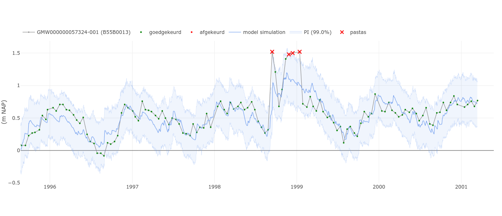

# GW DataLens: Dashboard for quality control of head observations



GW DataLens is a dashboard that can be used to view and check head time series.
This dashboard runs in a browser (e.g. Firefox, Chrome) and connects to a
database (e.g. PostgreSQL, or Hydropandas ObsCollection) to load and run error
detection algorithms on stored head time series.

## Installation

Clone the repository to your computer (or download a zip from GitHub and extract it).

Open a terminal (e.g. Terminal, Anaconda Prompt), navigate to the folder containing the repository
and install `gwdatalens` with

```bash
pip install -e .
```

## Usage

The dashboard can be run both as a stand-alone application, or as part of the Django
application [BRO-Connector](https://github.com/nens/bro-connector).

The settings for the dashboard are stored in the `gwdatalens/app/config.toml` file.

### Stand-alone

Currently, the app is set up to connect to a PostgreSQL database (a local copy
of the Provincie Zeeland database). For more information about the database,
see [DJANGO HELP](gwdatalens/django/DJANGO_HELP.md).

For a standalone run the configuration settings for the database (user,
password, host, etc.) are stored in the `database.toml` file. See the
`database_template.toml` file. Modify entries to match your database and rename
the file to `database.toml`.

Once you have modified the TOML files for your setup, the dashboard can be
launched from the command-line with:

```bash
gwdatalens [--debug True|False] [--port int]  # --debug and --port are optional
```

### BRO-Connector

For implementing GW DataLens under BRO-Connector, follow these steps:

1. Modify `gwdatalens/app/config.toml`, and set `DJANGO_APP = true`.
2. Copy GW DataLens to the BRO-Connector root directory with
   `cp_gwdatalens_to_broconnector [BRO_CONNECTOR_PATH]` or modify the `django_copy.py`
   file to point to the correct path and run the file with `python django_copy.py`.
3. Update `main/urls.py` file and `main/settings/settings.py` as outlined in this readme
   file: [DJANGO_HELP](gwdatalens/django/DJANGO_HELP.md)
4. Prepare the BRO-Connector application as
   [outlined here](https://github.com/nens/bro-connector?tab=readme-ov-file#installeren-van-django-applicatie)
5. Run the application with `python manage.py runserver` (from the directory containing
   the `manage.py` file).

More background and information is available in
[DJANGO_HELP](gwdatalens/django/DJANGO_HELP.md) and at the
[BRO-Connector repository](https://github.com/nens/bro-connector).

### Using a HydroPandas ObsCollection as "database"

The application can also be run using a HydroPandas ObsCollection as a data source.

Replace the current `PostgreSQLDataSource()` with `HydropandasDataSource()`. This
data source can be instantiated in a few ways:

- specify an extent (xmin, xmax, ymin, ymax) and `source="bro"`. This will download
  all groundwater level observations within an extent, and store the resulting
  `ObsCollection` as a pickle-file (for faster loading next time). To update the data,
  delete the pickle-file and let the download run again.
- specify a file name (e.g. `fname="oc.pkl"`) containing a pickled `ObsCollection`.
  Specify the data source (`"dino"` or `"bro"`) of the file.
- Specify an `ObsCollection` instance using `oc=oc`.

See the documentation for `HydropandasDataSource` for more information.

## Data validation with GW DataLens

The GW DataLens dashboard can be used to validate/check groundwater measurements.

The validation process consists of the following steps:

   1. Select a head time series from a database. ([Overview](#overview-tab))
   2. Run a set of error-detection rules to identify potentially suspect measurements. ([Error Detection](#error-detection-tab))
   3. The time series is manually reviewed (accepting or rejecting) suggestions made by the  error detection algorithm. ([Manual Review](#error-detection-tab))

Optionally, time series models can be inspected or created using the [Time Series Models](#time-series-models-tab) tab. These models can be used in the error detection step.

### Overview tab


The overview tab consists of three elements:

- Interactive map view showing measurement locations (top left)
- Interactive table showing measurement location metadata (top right)
- Interactive chart showing time series (bottom)

There are two ways of plotting head time series:

- Select one or multiple (up to 10, this value can be changed in `config.toml`)
  measurement locations on the map using your mouse or the rectangle selection tool.
- (Shift+)Click on row(s) in the table.

### Time Series Models tab


The time series models tab allows users to create or inspect time series models using
Pastas and Pastastore. Models are created using precipitation and evaporation from the
nnearest KNMI station.

### Error Detection tab


The Error Detection tab lets you run automatic error detection schemes on head time
series (see the [`traval`](https://traval.readthedocs.io) package). The rules that
comprise the error detection algorithm are shown in the expandable section at the
bottom. The error detection rules that are applied can be modified or adjusted in the
dashboard.

Steps:

   1. Use the first dropdown to select or search for any time series in the database.
   2. Optionally modify the rules or parameters used for error detection under the `Show Parameters` button.
   3. Press the "Run TRAVAL" button.
   4. The chart will update showing the original time series and the measurements that were deemed suspect by the error detection algorithm. If available a pastas model simulation and prediction interval are also shown in the chart.

### Manual Review tab


The Manual Review tab lets you review the results of the error detection scheme and
commit your manual review to the database, or download the results as a CSV file.

### References

- Documentation for [traval](https://traval.readthedocs.io/en/latest/).
- Documentation for [pastas](https://pastas.dev/).
- Documentation for [pastastore](https://pastastore.readthedocs.io/en/latest/).
