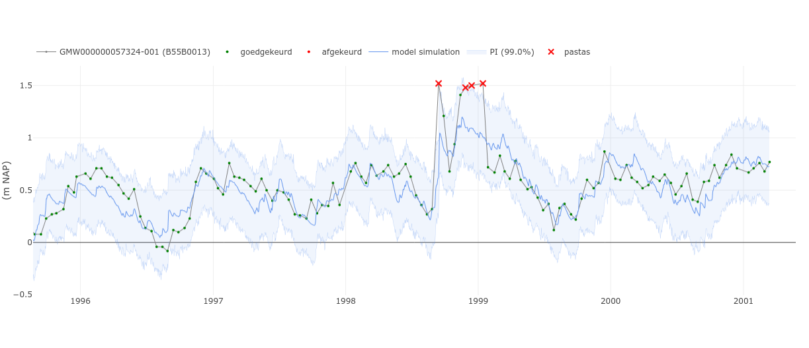

# GW DataLens: Dashboard for quality control of head observations



GW DataLens is a browser-based dashboard for viewing and quality-controlling groundwater head time series. It connects to a PostgreSQL database or a PastaStore and runs error-detection algorithms on stored time series.

## Installation

```bash
pip install gwdatalens
```

To configure or develop the application, install from source instead:

```bash
git clone https://github.com/ArtesiaWater/gwdatalens.git
cd gwdatalens
pip install -e .
```

## Quick start

### PastaStore (simplest)

Start GW DataLens by starting the application from the command-line:

```bash
gwdatalens
```

This opens the app in an empty state. Use the **Load PastaStore** button (top right) to load a `.pastastore` file or zip archive.

To startup with BRO data within a spatial extent (EPSG:28992):

```bash
gwdatalens --extent XMIN XMAX YMIN YMAX
```

This downloads time series via `hydropandas.read_bro()` and loads them into an in-memory PastaStore. Large extents may take a while to download.

### PostgreSQL (stand-alone)

1. In `gwdatalens/app/config.toml`, set `DATA_BACKEND = "postgresql"`.
2. Copy `gwdatalens/app/database_template.toml` to `gwdatalens/app/database.toml` and fill in your credentials:

   ```toml
   [database]
   database = "mydb"
   user = "myuser"
   password = "mypassword"
   host = "localhost"
   port = "5432"
   ```

3. Run `gwdatalens`.

See [DJANGO_HELP](gwdatalens/django/DJANGO_HELP.md) for more information on the expected database structure.

### PostgreSQL (BRO-Connector)

1. In `config.toml`, set `DJANGO_APP = true` and `DATA_BACKEND = "postgresql"`.
2. Copy GW DataLens into BRO-Connector:

   ```bash
   cp_gwdatalens_to_broconnector /path/to/bro-connector
   ```

3. Update `main/urls.py` and `main/settings/settings.py` as described in [DJANGO_HELP](gwdatalens/django/DJANGO_HELP.md).
4. Set up BRO-Connector as [outlined here](https://github.com/nens/bro-connector?tab=readme-ov-file#installeren-van-django-applicatie).
5. Run with `python manage.py runserver`.

## Configuration

Settings are stored in `gwdatalens/app/config.toml`. The most commonly changed options:

| Setting | Default | Description |
|---|---|---|
| `DATA_BACKEND` | `"postgresql"` | Data source: `"postgresql"` or `"pastastore"` |
| `LOCALE` | `"nl"` | Language: `"nl"` or `"en"` |
| `PORT` | `8050` | Dashboard port |
| `LOG_LEVEL` | `"DEBUG"` | Log level: `DEBUG`, `INFO`, `WARNING`, `ERROR` |
| `SERIES_LOAD_LIMIT` | `50` | Max time series loaded simultaneously |

CLI arguments override `config.toml`:

```bash
gwdatalens --port 8080 --locale en --log-level INFO
```

Settings can also be set via environment variables, which override `config.toml` but are overridden by CLI arguments:

```
GWDATALENS_PORT=8080
GWDATALENS_LOCALE=en
GWDATALENS_LOG_LEVEL=INFO
GWDATALENS_DB_HOST=localhost
GWDATALENS_DB_PORT=5432
GWDATALENS_DB_NAME=mydb
GWDATALENS_DB_USER=myuser
GWDATALENS_DB_PASSWORD=mypassword
```

## Data validation workflow

1. **Select** a time series. ([Overview tab](#overview-tab))
2. **Run error detection** to flag suspect measurements. ([Error Detection tab](#error-detection-tab))
3. **Correct** measurements where the correct value is known. ([Corrections tab](#corrections-tab))
4. **Review** and accept or reject flagged measurements, then commit to the database. ([Review tab](#review-tab))

Optionally, create or inspect time series models in the [Time Series Models tab](#time-series-models-tab). Models can be used in the error detection step.

### Overview tab


- Interactive map (top left), metadata table (top right), and time series chart (bottom).
- Select locations on the map or (Shift+)click table rows to plot time series (up to 50 by default; configurable in `config.toml`).

### Time Series Models tab


Create or inspect Pastas time series models. Models use precipitation and evaporation from the nearest KNMI station.

### Error Detection tab


Runs automatic error detection using the [`traval`](https://traval.readthedocs.io) package.

1. Select a time series from the dropdown.
2. Optionally adjust detection rules under **Show Parameters**.
3. Click **Run TRAVAL**. The chart shows suspect measurements, and (if available) a Pastas model simulation with prediction interval.

### Corrections tab


View all time series at a location with well configuration and screen depth metadata. Edit one or two time series simultaneously. Corrections can be saved to or reset from the database (where supported).

### Review tab


Accept or reject flagged measurements and commit the review to the database, or download results as a CSV file.

## References

- [hydropandas](https://hydropandas.readthedocs.io/en/latest/)
- [pastas](https://pastas.dev/)
- [pastastore](https://pastastore.readthedocs.io/en/latest/)
- [traval](https://traval.readthedocs.io/en/latest/)
